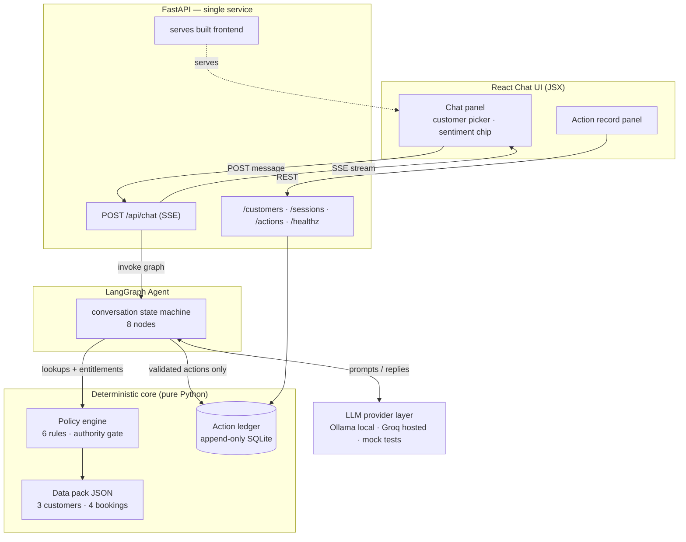
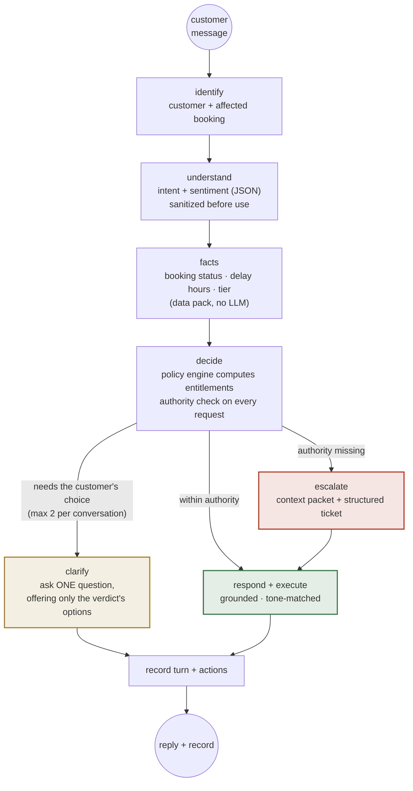

# SkyAssist — Architecture

**Assignment 3 · Agentic AI Factory · Customer-Facing Resolution Agent (Airline Disruption)**

Status: built. Exercise date: Wednesday, 23 September 2026. All facts come exclusively from the
supplied data pack — nothing is invented.

---

## 1. The one design rule

> **The LLM talks, the code decides.**

The brief supplies all data and forbids inventing any, so there is no RAG corpus to search and
no reason for the model to hold policy in its "head". Instead:

- a **typed JSON data pack** (3 customers, 4 bookings, a small flight list) is the only source
  of facts;
- a **deterministic policy engine** holds the six service rules and the allowed/prohibited
  action matrix as pure, unit-tested Python;
- the **LLM only classifies** (intent, sentiment) and **phrases pre-computed verdicts** in the
  house tone.

Consequence: the model *cannot* misissue a voucher, hallucinate a waiver, or promise an
upgrade — anything not validated by the authority gate simply never executes.

---

## 2. System overview



| Layer | Component | Responsibility |
|---|---|---|
| Client | React 18 (JSX) | Chat with streaming replies, customer picker, live sentiment chip, action-record panel with executed/declined/escalated chips and the rule cited for each |
| API | FastAPI | One SSE endpoint + REST reads; serves the built frontend as a single deployable service |
| Agent | LangGraph `StateGraph` | 8 nodes, conditional edges; every reply routed through the authority gate, clarification bounded via the ledger |
| Decisions | Policy engine | The brief's 6 rules + the authority gate; every rupee is computed here |
| Records | SQLite ledger | Append-only turns, actions and escalation tickets; replayable conversation + action record |
| LLM | Provider layer | OpenAI-compatible client switched by env var: `ollama` (local, demo video), `groq` (hosted Render), `mock` (tests, CI) |

**Deployment shape:** one service. FastAPI serves `frontend/dist` at `/`, so the reviewer
opens a single Render URL; locally `./run.sh` does the same on port 8000.

---

## 3. Conversation flow (the LangGraph state machine)



**Every customer-facing message is produced downstream of `decide`.** Clarification is not an
exception to that rule: the policy engine itself returns a verdict with status `clarify`
carrying the options the customer may choose between, and the clarify node may phrase nothing
else. There is no path to a reply that did not pass the authority gate.

Nodes (one small job each — which is what lets a local 8B model succeed):

1. **identify** — pure lookup: session knows the customer; resolves the affected booking;
   asks which flight only if genuinely ambiguous.
2. **understand** — LLM returns strict JSON: `intent` (fixed enum), `sentiment`
   (`calm · frustrated · angry · confused`), `requested_actions`, `legal_threat`.
   Temperature 0.1, one validated retry.
3. **facts** — deterministic reads from the data pack. No LLM.
4. **clarify** — runs *after* `decide`, driven by a `clarify` verdict from the engine
   (e.g. "cancelled flight: rebooking or refund?"). It receives only that verdict's
   `payload.options` — never the raw facts — so it cannot name a flight, an amount, or a
   policy the engine did not authorise. Hard cap of 2 questions per conversation, counted
   from the ledger's `clarify` rows rather than guessed from message text.
5. **decide** — *the hinge.* Every requested action passes
   `policy_engine.evaluate_request()`; returns per-request verdicts:
   `execute`, `decline` (with reason), or `escalate` (with trigger). Adds proactive standard
   compensation for qualifying delays (once per session — Sample B behaviour).
6. **escalate** — builds the human's context packet (conversation, facts, rules checked,
   trigger) **and persists it as a structured ticket** (`SKY-0001`, …) with a priority, so
   the handover is a record a human can pick up rather than a claim in the reply text. Legal
   threats and formal complaints are raised at high priority. The customer still gets an
   honest, Sample-C-style reply, quoting the ticket reference.
7. **respond** — the LLM writes the reply from a template of facts + verdicts + a
   sentiment-selected tone directive. Nothing else is speakable.
8. **record** — appends the turn and one ledger entry per action with its authorizing rule.

---

## 4. The policy engine (the brief's rules as code)

| Rule (data pack, verbatim) | Engine function | Behaviour |
|---|---|---|
| Cancellation Rebooking | `entitle_cancellation(booking)` | Airline-caused cancellation → customer's choice: free rebooking on next available flight within 24h **or** full refund |
| Delay Compensation | `delay_compensation(hours)` | <3h → ₹500 meal voucher · >3h → voucher + lounge · >5h → voucher + hotel covering **only the delayed hours** |
| Refund Processing | `refund(booking, method)` | Full refund in 7 business days, original payment method only — other method → prohibited → escalate |
| Fare Difference | `can_waive(amount)` | Agent may waive ≤ ₹1,500; above → supervisor approval → escalate |
| Loyalty Tier | `get_priority_rebooking(tier)` | Gold/Platinum → priority rebooking (first access to next-available seats). **Never** extra compensation |
| Allowed vs Prohibited | `evaluate_request()` + `_verdict()` | The single authority gate every request passes before anything executes. `_verdict()` enforces `ALLOWED_ACTION_TYPES`, so no code path can emit an effect outside the data pack's allowed list, and only an `execute` verdict may carry actions at all |

```python
def delay_compensation(delay_hours: float) -> Entitlement:
    if not delay_hours or delay_hours <= 0:
        return Entitlement()
    e = Entitlement(meal_voucher=500)      # under 3h: meal voucher
    if delay_hours > 3:
        e.lounge = True                     # more than 3h: + lounge
    if delay_hours > 5:
        e.hotel_hours = float(delay_hours)  # more than 5h: + hotel, delayed hours ONLY,
    return e                               # never a full night's stay
```

### Escalation triggers (the prohibited list)

| Trigger | Where it fires | Typical case |
|---|---|---|
| Compensation beyond stated policy | `evaluate_request` | Priya's "free business class for the trouble" |
| Fare-difference waiver above ₹1,500 | `can_waive` | Meher's ₹2,000 fare difference |
| Exceptions for non-airline-caused disruptions | `evaluate_request` | Customer missed the flight |
| Legal threats / formal complaints | `understand` → immediate | Sample C pattern |
| Refund to a different payment method | `refund` | "Send it to my other card" |

Escalation packets contain the conversation summary, the facts, the rules checked, and the
trigger — a human picks up mid-conversation instead of starting from zero.

---

## 5. Grounding & guardrails ("use only the supplied data — by construction")

1. **The data pack is the only memory.** Customers, bookings, statuses, delay hours, tiers,
   prior complaints live in one typed JSON file. Every node reads from it; the LLM's context
   receives exactly the relevant slice per turn.
2. **Numbers from code, words from the model.** The respond node receives pre-computed
   entitlements ("₹500 voucher + lounge, rule: delay >3h") and phrases them conversationally.
   It is never asked *what* to compensate.
3. **Action validation before execution.** LLM-proposed actions are structured proposals;
   only verdicts marked `execute` write to the ledger.
4. **Honest refusals.** Out-of-pack questions get "I don't have that information" — never a
   guess. Sample conversations A–C are used **for tone only**, exactly as the pack instructs.

---

## 6. Tone & de-escalation ("handle the angry or confused customer")

Every turn carries a structured sentiment classification that selects a tone directive in the
respond prompt:

| Sentiment | Tone directive | Structural behaviour |
|---|---|---|
| calm | Warm, direct, offer choices (Sample A) | Normal flow |
| frustrated | Apologize once, lead with the action taken (Sample B) | Confirm every action explicitly |
| angry | Name the frustration, take ownership, no deflection | Never asks unnecessary questions |
| confused | Short sentences, one option at a time | Restate their situation first |
| legal threat | Sample C — empathize, no admissions, no negotiation | **Immediate escalation**, no compensation discussed |

**Tone never changes entitlements.** An angrier customer gets a better-worded answer, not a
bigger voucher. The sentiment chip is shown live in the UI so a reviewer can watch the agent
recognize and adapt to emotion.

---

## 7. API & records

| Method | Path | Purpose |
|---|---|---|
| POST | `/api/chat` | Run the graph for one message; SSE stream |
| GET | `/api/customers` | The three profiles (masked) for the picker |
| GET | `/api/sessions` | Every session handled (audit-trail index) |
| GET | `/api/sessions/{id}` | Full conversation record, replayable, **with the verdicts that drove each turn** |
| GET | `/api/actions` | Append-only action ledger (all, or `?session_id=`) |
| GET | `/api/tickets` | Structured escalation tickets (all, or `?session_id=`) |
| GET | `/healthz` | Status + LLM provider |

Three tables back this: `turns` (transcript + the verdicts JSON for each turn), `actions`
(one row per executed / declined / escalated / clarified action, each carrying its
authorizing rule), and `tickets` (the structured handover packet, its priority, and its
open status). Nothing is ever updated or deleted.

SSE contract:

```
event: session     data: {"session_id": "SES-5e81115a"}
event: sentiment   data: {"intent": "refund", "sentiment": "angry"}
event: token       data: {"text": "I completely understand the frustration"}
event: action      data: {"type": "initiate_refund", "status": "executed", "rule": "refund_processing"}
event: action      data: {"type": "upgrade", "status": "declined", "reason": "beyond stated policy"}
event: done        data: {"turn_id": 42}
```

Example ledger entry (Scenario 2, Arvind):

```json
{
  "session_id": "SES-31",
  "turn_id": 3,
  "action_type": "arrange_hotel_delayed_hours",
  "status": "declined",
  "detail": "hotel: Hotel accommodation applies only when a delay exceeds 5 hours.",
  "rule": "delay_compensation"
}
```

The ledger is append-only (no UPDATE/DELETE) and every entry links to the authorizing rule —
this is the "preserve a clear conversation and action record" requirement, replayable via the
API and visible live in the UI's action-record panel.

---

## 8. The three scored scenarios as acceptance tests

| # | Customer | Situation | Correct agent path |
|---|---|---|---|
| 1 | Priya Nair · Gold · SK4821X | SK-204 cancelled; furious; wants full cash refund **+ free business upgrade** | Angry tone; refund **executed** (7 business days, original method); upgrade **declined** — beyond stated policy; Gold priority rebooking offered. If she insists on the upgrade → **escalate** |
| 2 | Arvind Kulkarni · Silver · TR1190B | SK-118 delayed 4h; frustrated (missed meeting); wants a hotel | ₹500 meal voucher + lounge **executed**; hotel **declined** (applies only above 5h), rule cited; missed meeting → no extra compensation |
| 3 | Meher Kaur · Platinum · WL7742 | SK-305 delayed 6h; wants a **full night's hotel**; wants a higher-fare flight (**₹2,000 fare difference**) | Voucher + lounge + hotel for the 6 delayed hours **executed**; full night **declined**; ₹2,000 waiver **escalated** (limit ₹1,500) with context packet; priority rebooking free |

All three are encoded as pytest fixtures: `backend/policy/test_engine.py` (rules, no LLM) and
`backend/test_graph.py` (full pipeline via the deterministic mock provider). 32 tests.

The traps each scenario tests: (1) an over-eager agent "making it right" with an upgrade;
(2) a 4-hour delay that *feels* hotel-worthy to a human and an LLM; (3) two different
over-reaches needing **different** verdicts — decline vs escalate — while Platinum status must
not unlock anything extra.

---

## 9. Repository & deployment

```
skyassist/
├── backend/
│   ├── main.py                  FastAPI: SSE chat, REST reads, serves frontend/dist
│   ├── agent/
│   │   ├── graph.py             LangGraph state machine + conditional edges
│   │   ├── state.py             TurnState TypedDict
│   │   ├── nodes/               identify · understand · facts · clarify · decide · escalate · respond · record
│   │   └── prompts.py           Per-node prompts, tone directives, Sample A/B/C style
│   ├── policy/
│   │   ├── engine.py            The 6 rules + authority gate (pure Python)
│   │   └── test_engine.py       The 3 scenarios as unit tests
│   ├── data/
│   │   ├── datapack.json        The ONLY source of facts
│   │   └── loader.py            Typed accessors
│   ├── records/ledger.py        Append-only SQLite ledger + transcripts
│   ├── llm/provider.py          ollama | groq | mock, OpenAI-compatible
│   └── test_graph.py / test_api.py
├── frontend/                    React 18 (Vite dev, esbuild prod build)
├── Dockerfile                   Multi-stage: node builds, python serves
├── render.yaml                  Render blueprint
├── run.sh                       One-command local run
└── ARCHITECTURE.md              This document
```

| Environment | How |
|---|---|
| Local (demo video) | `./run.sh ollama` — llama3.1:8b via Ollama, zero API cost |
| Hosted (submission) | Render blueprint (Dockerfile): single web service, `LLM_PROVIDER=groq` + `GROQ_API_KEY` |
| Tests / CI | `LLM_PROVIDER=mock` — the entire pipeline runs deterministically with no LLM |
| Reviewer fallback | The brief allows a clearly documented one-command local run; README covers both paths |

---

## 10. Requirement coverage

| Brief requirement | Where it lives |
|---|---|
| Understand the customer's intent | `understand` — intent enum + requested actions + sentiment, strict JSON |
| Ask only necessary questions | `clarify` verdict from the policy engine — asked only when the decision genuinely branches on the customer's choice, max 2 per conversation (counted in the ledger) |
| Use the supplied data and policies | Data pack JSON + policy engine; guardrails §5 |
| Recommend or execute the correct next action | `decide` → validated action execution in the ledger |
| Handle an angry or confused customer | Sentiment classification → tone directives, Samples A/B/C (tone only) |
| Escalate when authority is missing | Authority gate — 5 prohibited triggers → escalation packet |
| Preserve a clear conversation and action record | Transcripts + append-only action ledger, replayable via API and UI |

## 11. Assumptions & risks

**Assumptions** (also in README):

- Exercise date fixed at Wed 23 Sep 2026; all reasoning is relative to the data pack.
- **No flight schedules or fares were supplied, so none are modelled.** The agent says "the
  next available flight within 24 hours" — the rule's own wording — and never names a
  specific flight number, time, or seat. `backend/data/loader.py` deliberately exposes no
  schedule accessor, so nothing downstream can reach for one.
- **Fare differences are customer-stated and unverified.** Nothing in the pack prices a
  flight, so the ₹2,000 in Scenario 3 can only come from the customer. It carries
  `fare_difference_source: "customer_stated"` through the verdict, the ledger and the
  escalation ticket, and a waiver request with no establishable amount escalates rather than
  auto-approving.
- PNR discrepancy in the pack (`TR1190B` profile vs `TR11390B` scenario text) normalized to
  `TR1190B`.
- Delay boundaries at exactly 3h/5h treated as "not more than" — the pack says "under 3
  hours" and "more than 3/5 hours", leaving the boundary itself undefined, so the agent
  resolves it conservatively. Both boundaries are unit-tested.
- Refund/rebooking "execution" is a ledger write — no real payment integration.
- Customer identity via picker (simulating an authenticated channel).

**Risks & mitigations:**

- *Local 8B model misformats JSON* → one small prompt per node, temperature 0.1, one
  validated retry, and the authority gate means a misread can never cause a wrong payout.
- *Groq rate limits during review* → local Ollama is the recorded-demo path; hosted URL is
  for the reviewer's own pace.
- *Render free tier sleeps* → ~30s cold start, documented in README.
- *Over-eager LLM promises* → the respond prompt only receives pre-computed verdicts;
  nothing else is speakable.
